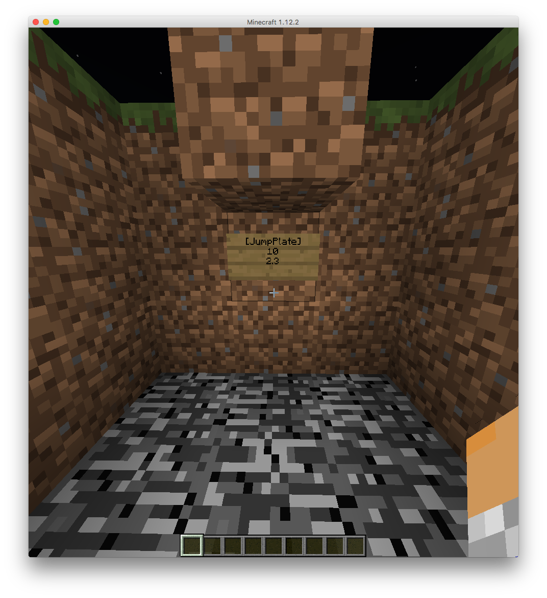

# JumpPlates

JumpPlates for Sponge

https://youtu.be/CTDB_Ld6-g0

## Setup

1. Place a stone pressure plate
2. Make a sign under the block of the plate
3. Add on line 1 `[JumpPlate]`
4. Add on line 2 the strength `10.0`
5. Add on line 3 the height `2.3`

## Permissions
- `jumpplates.reate` to create a jumpplate sign